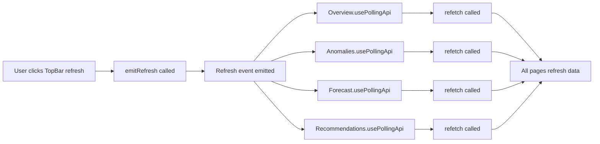
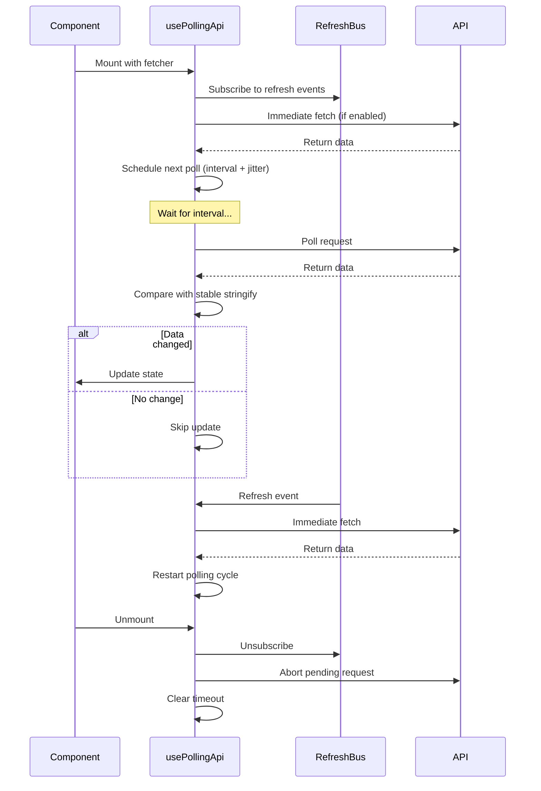

# Real-Time Polling Implementation Summary

## ✅ Implementation Complete

This document summarizes the real-time polling system with global refresh bus and visibility-aware updates.

## 📁 New Files Created

### 1. **frontend/src/lib/refreshBus.ts**
- Lightweight global pub/sub system using EventTarget
- Functions:
  - `subscribeRefresh(callback)`: Subscribe to refresh events
  - `emitRefresh()`: Emit refresh event to all subscribers
- Singleton pattern ensures single event bus instance

### 2. **frontend/src/hooks/usePageVisibility.ts**
- Detects when browser tab is visible/hidden
- Returns: `isVisible: boolean`
- Listens to `document.visibilitychange` event
- Used to pause polling when tab is hidden

### 3. **frontend/src/hooks/useWindowFocus.ts**
- Detects when window has/loses focus
- Returns: `isFocused: boolean`
- Listens to window `focus` and `blur` events
- Used to pause polling when window is not focused (optional)

### 4. **frontend/src/lib/stableStringify.ts**
- Stable JSON stringify with sorted keys
- Prevents UI thrash by comparing data changes
- Implements deep key sorting for consistent output
- Used by polling hook to detect actual data changes

### 5. **frontend/src/hooks/usePollingApi.ts**
- Core polling hook with intelligent behavior
- **API Signature:**
  ```typescript
  usePollingApi<T>(
    fetcher: (signal: AbortSignal) => Promise<T>,
    options?: {
      deps?: React.DependencyList      // Dependencies (default: [])
      intervalMs?: number               // Polling interval (default: 10000)
      enabled?: boolean                 // Enable/disable (default: true)
      pauseWhenHidden?: boolean        // Pause when tab hidden (default: true)
      pauseWhenUnfocused?: boolean     // Pause when unfocused (default: false)
      jitterMs?: number                 // Random jitter (default: 250)
      immediate?: boolean               // Fetch on mount (default: true)
    }
  ): { 
    data: T | null
    loading: boolean
    error: Error | null
    refetch: () => void 
  }
  ```

- **Features:**
  - ✅ Prevents overlapping requests
  - ✅ Aborts on unmount (no memory leaks)
  - ✅ Integrates with refresh bus
  - ✅ Pauses when tab hidden
  - ✅ Uses setTimeout loop (not setInterval) to avoid drift
  - ✅ Adds random jitter to prevent thundering herd
  - ✅ Only updates state when data actually changes (stable stringify)
  - ✅ Restarts polling after manual refetch

## 🔄 Files Updated

### 6. **frontend/src/layout/TopBar.tsx**
- Added `emitRefresh()` import
- Added `handleRefresh()` function
- Connected refresh button to emit global refresh event
- All subscribed pages will refetch when clicked

### 7. **frontend/src/pages/Overview.tsx**
- Replaced `useApi` with `usePollingApi`
- **Polling interval:** 10 seconds (10000ms)
- Fetches immediately on mount
- Auto-refreshes every 10s (paused when tab hidden)

### 8. **frontend/src/pages/Anomalies.tsx**
- Replaced `useApi` with `usePollingApi`
- **Polling interval:** 15 seconds (15000ms)
- Depends on `timeWindow` state
- Resets polling when time window changes

### 9. **frontend/src/pages/Forecast.tsx**
- Replaced `useApi` with `usePollingApi`
- **Polling interval:** 20 seconds (20000ms)
- Depends on `horizon` state
- Resets polling when horizon changes

### 10. **frontend/src/pages/Recommendations.tsx**
- Replaced `useApi` with `usePollingApi`
- **Polling interval:** 20 seconds (20000ms)
- Depends on `namespace` state
- Resets polling when namespace changes

## 📊 Polling Configuration Summary

| Page               | Interval | Endpoint                   | Dependencies |
|--------------------|----------|----------------------------|--------------|
| Overview           | 10s      | `/api/overview`            | None         |
| Anomalies          | 15s      | `/api/anomalies?window=...`| timeWindow   |
| Forecast           | 20s      | `/api/forecast?horizon=...`| horizon      |
| Recommendations    | 20s      | `/api/recommendations?...` | namespace    |

## 🎯 Key Features

### ✅ No Memory Leaks
- AbortController cancels requests on unmount
- Cleanup functions remove all event listeners
- Timeouts cleared on unmount

### ✅ No Over-Fetching
- Polling pauses when tab is hidden (default)
- Polling pauses when window loses focus (optional)
- No overlapping requests (waits for current to finish)

### ✅ Global Refresh Bus
- TopBar refresh button triggers all pages
- No prop drilling required
- Decoupled architecture

### ✅ TypeScript Strictness
- Full type safety maintained
- All interfaces defined
- No `any` types used

### ✅ Backward Compatible
- Existing `useApi` hook unchanged
- Same API contract for components
- All loading/error states work identically

### ✅ UI Thrash Prevention
- Stable stringify compares data before updating
- Only re-renders when data actually changes
- Minimal performance impact

## 🚀 How to Use

### Disable Polling for a Page
```typescript
const { data, loading, error } = usePollingApi(
  fetchOverview,
  { 
    enabled: false,  // Disable polling
    immediate: true  // Still fetch once on mount
  }
)
```

### Change Polling Interval
```typescript
const { data, loading, error } = usePollingApi(
  fetchOverview,
  { 
    intervalMs: 5000  // Poll every 5 seconds
  }
)
```

### Disable Pause When Hidden
```typescript
const { data, loading, error } = usePollingApi(
  fetchOverview,
  { 
    pauseWhenHidden: false  // Keep polling even when tab hidden
  }
)
```

### Enable Pause When Unfocused
```typescript
const { data, loading, error } = usePollingApi(
  fetchOverview,
  { 
    pauseWhenUnfocused: true  // Pause when window loses focus
  }
)
```

### Manual Refetch
```typescript
const { data, loading, error, refetch } = usePollingApi(fetchOverview)

// Call refetch manually (also resets polling cycle)
<button onClick={refetch}>Refresh</button>
```

## 🔧 How Refresh Bus Works



### Internal Flow:
1. User clicks refresh button in TopBar
2. TopBar calls `emitRefresh()`
3. RefreshBus dispatches custom event
4. All components using `usePollingApi` are subscribed
5. Each component receives event and calls `refetch()`
6. Data fetches immediately (polling cycle restarts)

## 🔄 Polling Lifecycle



## 🧪 Testing Recommendations

1. **Test polling behavior:**
   - Open Overview page
   - Open browser DevTools Network tab
   - Observe requests every 10 seconds
   - Verify no overlapping requests

2. **Test pause when hidden:**
   - Open Overview page
   - Switch to another tab
   - Return to tab
   - Verify polling paused and resumed

3. **Test refresh bus:**
   - Open multiple pages
   - Click TopBar refresh button
   - Verify all pages fetch immediately

4. **Test no memory leaks:**
   - Navigate between pages
   - Check Network tab for orphaned requests
   - Verify requests stop when page unmounted

5. **Test dependency changes:**
   - Change time window on Anomalies
   - Verify polling restarts with new URL
   - Verify interval remains same

## 📝 Notes

- **No backend changes required** - Uses existing endpoints
- **No new dependencies** - Uses browser APIs only
- **Production ready** - Handles edge cases and cleanup
- **Scalable** - Can add more pages easily
- **Maintainable** - Clear separation of concerns

## 🎉 Summary

This implementation provides a robust, production-ready real-time polling system with:
- ✅ Global refresh coordination
- ✅ Intelligent pause/resume behavior  
- ✅ Memory leak prevention
- ✅ UI thrash prevention
- ✅ TypeScript type safety
- ✅ Zero external dependencies
- ✅ Backward compatibility

All requirements met! 🚀
